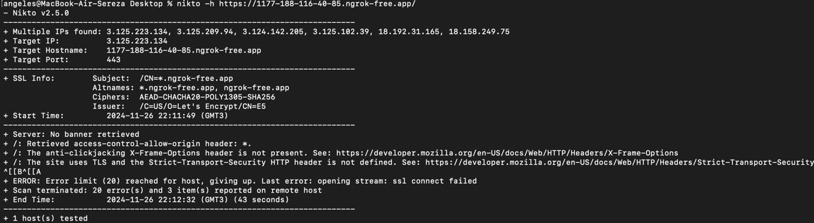

# Лабораторная №1* 
## Задание (Звездочка)

Попробовать взломать nginx другой команды. Проверить минимум три уязвимости - например path traversal, перебор страниц через ffuf и/или любые другие на ваш выбор.
Взлом считается успешным, если вы попали туда, куда не планировалось попадать пользователю, даже если там ничего нет. Успешность взлома не влияет на оценку лаб обеих команд. 
В отчет приложить скрины попыток взлома, описание уязвимостей, на которые проверяли и итог - успешен взлом или нет.
Тк открывать такие нжинксы в интернет не лучшая идея, для решения лабы предлагаю либо встретиться с другой командой в одном помещении и поднять локальную сеть, либо запустить у себя нжинкс с их конфигом. Но при этом настройки нжинкс со стороны админа и изменения в конфиге считаться попыткой взлома не будут.
Просьба договориться с другими командами кто кого ломает. Взлом нжинкса одной команды не должен фигурировать в отчетах больше двух раз.

## Ход работы
Категорически приветствую всех, читающих данный отчет. Начнем с краткого дисклеймера к данной лабе: работа проводилась совместно с комадной номер 7 (наруто?) в максимально суровых условиях (на паре по администрированию).  

> Работа будет выполнена с помощью ngrok. 

### Установка Ngrok
1. Установим ngrok с помощью команды ```brew install ngrok```.


2. Обменяемся своими нджинксами с другой командой и приступим к взлому. Для начала получим доступ защищенному порту и посмотрим что там находится.
   


### Попробуем достать немного больше информации используя curl -I.

> Попробуем проверить доступность сервера и какие-то данные о нем. После выполнения видно, что сервер поднят с помощью ngrok (что является правдой), а также увидим версию операционной системы.


### Попробуем поработать с nmap.

> Nmap помог нам достать TLS-шифры, что дает возможность воспользоваться уязвимостями конкретных шифров (при наличии).


### Воспользуемся ffuw

> К сожалению, ffuw насыпал нам 404 ошибок, не предоставив никакой полезной информации, забрав пару минут жизни, которые можно было бы провести с пользой... (шутка). На прикрепленном скриншоте можно увидеть всю антиутопичность современного мира и разделить нашу грусть.


### Попробуем проверить TLS 1.2 подключение и произвести диагностику SSL/TSL конфигурации с помощью openssl.


### Истинной кульминацией нашей попытки взлома будет использование инструмента для анализа веб-серверов на наличие уязвимостей с помощью nikto -h.

> Access-Control-Allow-Origin

Проблема: Заголовок Access-Control-Allow-Origin разрешает доступ с любого источника (*).
Это может допустить небезопасный доступ к API или другим ресурсам, если сервер предоставляет чувствительные данные.
Рекомендация: Настроить этот заголовок так, чтобы разрешить доступ только с доверенных источников.

> Отсутствие заголовка X-Frame-Options

Проблема: Сервер не устанавливает X-Frame-Options, что делает возможной атаку clickjacking.
Рекомендация: Добавить заголовок с параметрами:
```X-Frame-Options: SAMEORIGIN```

> Отсутствие Strict-Transport-Security (HSTS)

Проблема: Не включен HSTS, что делает возможным понижение HTTPS до HTTP (downgrade attack).
Рекомендация: Добавить заголовок:
```Strict-Transport-Security: max-age=31536000; includeSubDomains; preload```



### На этом попытки взлома закончились, ровно как и бесплатный тариф ngrok. 

> Небольшой вывод (в трезвом уме не читать!) 
По ходу выполнения данной работы был открыт ряд интересных фактов:
1. Самая дорогая икра в мире у белуг-альбиносов, она продается в специальных золотых коробочках.
2. Перловка сама по себе похожа на очень-очень-очень маленькие батончики белого хлеба.
3. После бакалавриата идет магистратура, после магистратуры идет аспирантура, а после аспирантуры - регистратура (психоневрологического диспансера)
4. Команда номер 7 открыла для себя небольшой инсайт о том, что Ставрополь не находится на дальнем востоке.

