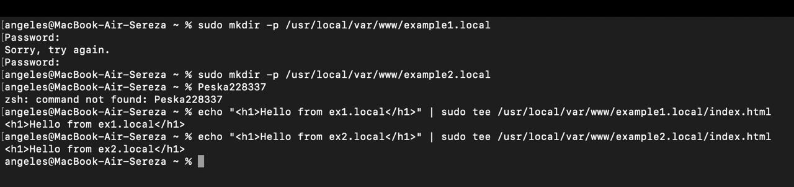
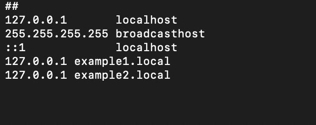

## Задание (обычная)

Настроить nginx по заданному тз:
1. Должен работать по https c сертификатом
2. Настроить принудительное перенаправление HTTP-запросов (порт 80) на HTTPS (порт 443) для обеспечения безопасного соединения.
3. Использовать alias для создания псевдонимов путей к файлам или каталогам на сервере.
4. Настроить виртуальные хосты для обслуживания нескольких доменных имен на одном сервере.

<b>Результат:</b> Предположим, что у вас есть два пет проекта на одном сервере, которые должны быть доступны по https. Настроенный вами веб сервер умеет работать по https, относить нужный запрос к нужному проекту, переопределять пути исходя из требований пет проектов.
В качестве пет проектов можете использовать что-то свое, можете что-то опенсорсное, можете просто код из трех строчек.


## Ход работы
Всем привет! Мы начали делать лабы не с первой, но первую тоже сделали :stuck_out_tongue_winking_eye:
<p align="center">

</p>

> Работа будет сделана на MacOS. В нашей группе есть полное разнообразие ОС: Linux (Дима), Windows (Арина), MacOS (Серёжа) и виртуалки. Серёжа вытянул короткую спичку.

### Установка Nginx
1. Установим nginx с помощью команды ```brew install nginx```.


2. Проверим успешность уcтановки ```brew servises start nginx```.
   


### Создание сертификатов

> Secure Socket Layer (SSL, слой защищенных сокетов) — это криптографический протокол, выпущенный Netscape в 1995 году. Этот протокольный уровень может располагаться поверх HTTP, тем самым добавляя в конец букву S (HTTPS), которая означает secure.

1. Создадим самоподписанный сертификат. Сгенерируем ключ для ROOT_CA (корневой сертификат). Параметр ```–days``` установлен на 365, значит сертификат действителен в течение следующих 365 дней. Параметр ```x509``` указывает на то, что это будет самозаверяющий сертификат. На выходе получим два файла: <b>root_ca.key</b> - приватный ключ корневого центра сертификации. <b>root_ca.cert</b> - самоподписанный корневой сертификат.
   
<b>Важно:</b> Центры сертификации не проверяют самоподписанные сертификаты. Таким образом, они не так безопасны, как проверенные! Но в нашей работе это не главное.


2. Проверим отображение созданного сертификата в браузере.


3. В приложении Apple Configurator добавим профиль нашего центра, чтобы подключаться по https.


### Настройка

1. Отредактируем файл nginx.conf. Поменяем порт подключения на 443 и пропишем пути на сертификат и ключ. *Заспидранили и перенаправили трафик http на https. Добавили блок сервера, который слушает 80 порт и отправляет всё на https.


2. Подключимся к localhost. Увидим отображение нашей страницы!


3. Создадим файлы и директории для обоих проджектов.



4. Отредактируем файл hosts (добавим домены и ip проджектов), чтобы не ждать делегирования домена.



5. Напишем conf файл для example1 и аналогично example2. В server_name вписываем адрес example1.local и в директиве location прописываем псевдоним для example1.local.

> Alias - псевдоним, который позволяет пользователю запускать любую команду или группу команд, в том числе с опциями, параметрами и файлами, вводом всего одного слова или даже символа.


6. Поочередно откроем проекты. Всё получилось.


### Не хочется потерять эти материалы по теме:
1. [Введение в OpenSSL: основы криптографиии](https://habr.com/ru/companies/otus/articles/666700/)
2. [Создание псевдонимов команд с помощью alias](https://redos.red-soft.ru/base/redos-7_3/7_3-administation/7_3-console/7_3-alias/?nocache=1730470105839)
3. [Файл hosts: где находится и как его изменить](https://help.reg.ru/support/dns-servery-i-nastroyka-zony/rabota-s-dns-serverami/fayl-hosts-gde-nakhoditsya-i-kak-yego-izmenit#0)
