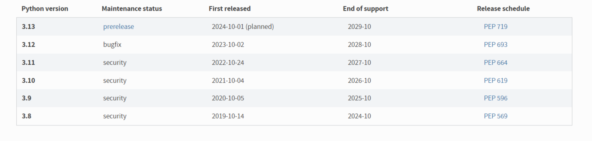

# Лабораторная №2 

## Задание (обычная)

1. Написать "плохой" Dockerfile, в котором есть не менее трех “bad practices” по написанию докерфайлов.
2. Написать "хороший" Dockerfile, в котором эти плохие практики исправлены.
3. В Readme описать каждую из плохих практик в плохом докерфайле, почему она плохая и как в хорошем она была исправлена, как исправление повлияло на результат.
4. В Readme описать 2 плохих практики по работе с контейнерами. ! Не по написанию докерфайлов, а о том, как даже используя хороший докерфайл можно накосячить именно в работе с контейнерами.


## Ход работы
### Напишем "плохой" Dockerfile, в котором есть не менее трех "bad practices" по написанию докерфайлов.

```
FROM python:latest


RUN apt-get update && apt-get install -y \
    build-essential \
    && pip install flask

COPY . /app

WORKDIR /app

CMD ["python", "app.py"]
```
Рассмотрим каждую ошибку по отдельности:
1. Использование тега `latest` делает сборку непредсказуемой. Т.к. `latest` - не что-то постоянное, а каждая новая версия образа может сломать совместимость приложения.
2. Отсутствует очистка кэша `APT`. Когда кэш не отчищается, образ контейнера становится больше - это влияет на время загрузки и количество выделенных ресурсов.
Очищение кэша с помощью команды `rm -rf /var/lib/apt/lists/*` после установки пакетов:
- Уменьшает итоговый размер образа. Это ускорит его передачу и запуск.
- Избавляет от ненужных временных файлов и улучшает безопасность.
- Делает контейнеры более эффективными в плане использования ресурсов.
3. Команда `COPY . /app`. Нельзя копировать все файлы проекта (всю директорию) в докер образ, это приведет к ненужному увеличению размера докерфайла и проблемам с безопасностью, т.к. среди них могут оказаться конфиденциальные данные.
### Напишем "хороший" Dockerfile, в котором эти плохие практики исправлены.
```
FROM python:3.9


RUN apt-get update && apt-get install -y build-essential \
	&& rm -rf /var/lib/apt/lists/* \	
    && pip install flask

COPY app.py /app/app.py

WORKDIR /app

CMD ["python", "app.py"]
```
Что стало лучше:
1. Тег `latest` изменён на `3.9`. Это поможет нам избежать ошибок при сборке, потому что версии python меняются очень быстро. Сейчас это `3.12.7`. Несмотря на это, мы сможем собрать образ с нужной версией (вчера, сегодня, завтра), что обеспечит его стабильность.
   
<b>Результат:</b> Более стабильный и воспроизводимый процесс сборки.

Состояние версий на 02.10.2024.



2. Используется команда `rm -rf /var/lib/apt/lists/*`, которая удаляет ненужные кэшированные файлы после установки пакетов (подробно описано в "плохой" практике).
<b>Результат:</b> Размер образа значительно уменьшен.

3. Копируется только один файл, необходимый для запуска приложения `app.py`. 
<b>Результат:</b> Меньший размер образа и улучшенная безопасность.


### Плохие практики по работе с контейнерами
1. Не ограничивать ресурсы для контейнера.

<b>Почему плохо:</b>

Без явного ограничения ресурсов (CPU, память) контейнер может потреблять больше, чем мы ожидаем. Это приведёт к уменьшению производительности устройства.

<b>Как это исправить:</b>

Запомним, что при запуске контейнеров всегда нужно указывать лимиты ресурсов. Например: `docker run --memory="256m" --cpus="1" <image>`. Это ограничит свободу контейнера и не повлияет на производительность.

2. Не делать мониторинг и логирование контейнеров.

<b>Почему плохо:</b>

Без мониторинга и логирования сложно отследить проблемы в приложении или контейнере. Это может ввести в заблуждение или увеличить время диагностики и отладки, когда проблема начнёт препятствовать работе.

<b>Как это исправить:</b>

Будем использовать инструменты мониторинга (например, [Prometheus](https://habr.com/ru/articles/709204/)) и централизованного логирования (например, [ELK-стек](https://habr.com/ru/articles/671344/)). Они помогут отслеживать состояние контейнеров и выявлять проблемы на ранних стадиях.

### Не хочется потерять эти материалы по теме:
1. [Как устроен Dockerfile](https://doka.guide/tools/dockerfile/)
2. [Docker – Setting Memory And CPU Limits](https://howtodoinjava.com/devops/docker-memory-and-cpu-limits/)
3. [Основы мониторинга (обзор Prometheus и Grafana)](https://habr.com/ru/articles/709204/)
4. [Как попробовать ELK-стек за один вечер и наконец-то перестать grep'ать логи](https://habr.com/ru/articles/671344/)


