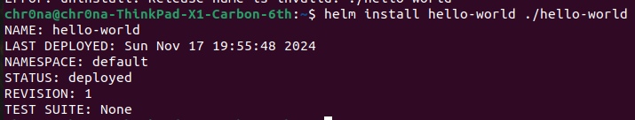
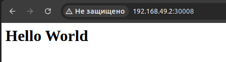
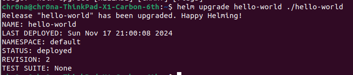

# Лабораторная №3*
## Задание (со звездочкой)

1. Создать helm chart на основе обычной 3 лабы
2. Задеплоить его в кластер
3. Поменять что-то в сервисе, задеплоить новую версию при помощи апгрейда релиза
4. В отчете приложить скрины всего процесса, все использованные файлы, а также привести три причины, по которым использовать хелм удобнее чем классический деплой через кубернетес манифесты

## Ход работы
### Создание helm chart-а

1. Для начала установим helm и проверим корректность установки
<p align="center">
  
</p>

2. Далее командой ```helm create hello-world``` создадим шаблон helm chart (структуру директории с шаблонами файлов)

<p align="center">
  
</p>

4. Удалим все ненужные файлы из шаблона, оставив только те, которые понадобятся при дальнейшей работе: ```Chart.yaml, values.yaml, configmap.yaml, deployment.yaml, _helpers.tpl и service.yaml```
   Подробное содержание всех этих файлов разберём далее.

Chart.yaml

```
apiVersion: v2
name: hello-world
description: A Helm chart for Kubernetes
version: 0.1.0
appVersion: "1.16.0"
```

Основной файл описания helm chart, который содержит метаданные (данные о данных): версию API Helm (v2 - современный стандарт), имя Helm chart, его краткое описание, версию самого chart и версию приложения ( в данном случае речь идёт о Nginx 1.16.0)

Values.yaml

```
replicaCount: 1

image:
  repository: nginx
  tag: alpine
  pullPolicy: IfNotPresent

service:
  type: NodePort
  port: 80
  targetPort: 80
  nodePort: 30008

configMap:
  indexHtml: |
    <html>
    <head><title>Hello World</title></head>
    <body><h1>Hello World</h1></body>
    </html>
```

Файл значений, задающий конфигурацию helm chart. Он упрощает настройку через шаблоны в других файлах. Здесь описаны: количество реплик подов, параметры контейнера (имя образа, тег образа (используется легковесная версия alpine), политика загрузки образа ( ```IfNotPresent``` означает, что образ загружается только если его нет в узле кластера)), настройки сервиса (тип Kubernetes сервиса (выбран NodePort - доступ извне через фиксированный порт), порт (80), порт контейнера (80), узловой порт для доступа к сервису (30008)) и сам контент, передаваемый в Configmap. В нашем случае это простой HTML-фалй, который будет отображаться Nginx

configmap.yaml

```
apiVersion: v1
kind: ConfigMap
metadata:
  name: {{ include "hello-world.fullname" . }}-config
data:
  index.html: |
{{ .Values.configMap.indexHtml | nindent 4 }}
```

Файл, который описывает Kubernetes configmap. ConfigMap используется для передачи конфигурационных данных в поды. Здесь указан тип объекта Kubernetes (```apiVersion и kind```), имя ConfigMap (```metadata: name :```), создается с использованием шаблона ```hello-world.fullname```. Данные ConfigMap хранятся в ```data:```. Здесь данные берутся из values.yaml через строчку ```.Values.configMap.indexHtml```. Строка ```| nindent 4``` добавляет отступ в 4 пробела перед строкой. Это важно для корректного форматирования YAML, потому что добавлять проблемы вручную это не самый надежный способ для настолько чувствительных к этому файлов, как .yaml

deployment.yaml

```
apiVersion: apps/v1
kind: Deployment
metadata:
  name: {{ include "hello-world.fullname" . }}-deployment
spec:
  replicas: {{ .Values.replicaCount }}
  selector:
    matchLabels:
      app: {{ include "hello-world.name" . }}
  template:
    metadata:
      labels:
        app: {{ include "hello-world.name" . }}
    spec:
      containers:
        - name: {{ include "hello-world.name" . }}
          image: "{{ .Values.image.repository }}:{{ .Values.image.tag }}"
          imagePullPolicy: {{ .Values.image.pullPolicy }}
          ports:
            - containerPort: {{ .Values.service.targetPort }}
          volumeMounts:
            - name: html-volume
              mountPath: /usr/share/nginx/html
      volumes:
        - name: html-volume
          configMap:
            name: {{ include "hello-world.fullname" . }}-config
```

Файл описывает развертывание приложения в Kubernetes. В начале указывается тип объекта Kubernetes, имя deployment создается, как и в configMap, через шаблон ```hello-world.fullname```. Количество реплик берётся из файла values.yaml строкой ```{{ .Values.replicaCount }}```. Селектор связывает Deployment с подами на основе метки app (```selector: matchLabels: app:```). Шаблон пода включает в себя метки для связи с Deployment. Далее в ```spec:``` описываются настройки контейнера: его имя, образ (собирается из репозитория и тега из values.yaml) и политика загрузки образа). Далее ```volumeMounts``` монтирует volume (в данном случае ConfigMap) в контейнер, и ```volumes:``` определяет volume, использующий ConfigMap

_helpers.tpl

```
{{- define "hello-world.name" -}}
hello-world
{{- end -}}

{{- define "hello-world.fullname" -}}
{{ .Release.Name }}-hello-world
{{- end -}}
```

Файл с шаблонными функциями, используемыми в других файлах. Первая функция возвращается фиксированное имя ```hello-world```, вторая возвращает полное имя ресурса, включающее имя релиза ```.Release.Name```

service.yaml

```
apiVersion: v1
kind: Service
metadata:
  name: {{ include "hello-world.fullname" . }}-service
spec:
  type: {{ .Values.service.type }}
  selector:
    app: {{ include "hello-world.name" . }}
  ports:
    - port: {{ .Values.service.port }}
      targetPort: {{ .Values.service.targetPort }}
      nodePort: {{ .Values.service.nodePort }}
```

Файл, описывающий Kubernetes Service для доступа к приложению. Здесь снова, как и в предыдущих файлах, ```hello-world.fullname``` создает имя сервиса, в ```spec:``` описаны тип сервиса (NodePort), селектор, связывающий сервис с подами на основе метки ```app``` и настройки портов - ```port``` это внешний порт, ```targetPort``` - порт в контейнере и ```nodePort``` - узловой порт. 
Итого helm chart разворачивает приложение с одним подом с Nginx, NodePort-сервисом для внешнего доступа и HTML-файлом, который отображается Nginx

### Деплой Helm Chart в кластер

1. Выполним команду ```helm install hello-world ./hello-world``` для установки релиза

<p align="center">
  
</p>

2. Откроем браузер и перейдём на адрес minikube, который узнали ещё в предыдущей работе, на порт 30008 ```http://192.168.49.2:30008```

<p align="center">
  
</p>

Видим, что деплой прошёл успешно

### Обновление релиза

1. Изменим файл values.yaml, поменяв в ```index.html``` заголовок и текст с ```Hello World``` на ```Hello World 2```

2. Обновим релиз командой ```helm upgrade hello-world ./hello-world

<p align="center">
  
</p>

3. Проверим изменения, обновив страницу в браузере

<p align="center">
  
</p>

На странице отображается уже обновленный текст, что означает, что всё прошло успешно

## Почему helm круче, чем просто манифесты Kubernetes

Назовем три причины, почему удобнее использовать helm, а не манифесты kubernetes. Итак:

### Поддержка шаблонов

При использовании классических манифестов часто приходится дублировать код для различных окружений. Helm же позволяет создавать динамические манифесты с использованием шаблонов, где параметры определяются через values.yaml, что делает повторное использование и поддержку конфигурации куда более удобной. Благодаря этому один и тот же Helm Chart даже можно использовать для разных окружений, просто подставляя нужные значения (реплики, ресурсы и переменные окружения)

### Управление версиями

При обновлении приложения вручную, сложно отслеживать предыдущие версии конфигурации и откатывать изменения. Helm же имеет встроенный version control: каждое развертывание записывается как новая версия, что позволяет легко откатиться назад в случае ошибки

### Упрощенное управление сложными приложениями

Для деплоя сложных приложений, состоящих из множества компонентов, требуется писать мнжество файлов манифестов и координировать их вручную. Helm же позволяет упаковывать все компоненты приложения в один единый chart. Установка, обновление и удаление происходят одной командой, что заметно упрощает работу.

Все эти особенности helm значительно упрощают управление приложениями в Kubernetes, делают инфраструктуру более гибкой, а разработку и поддержку - быстрее и безопаснее
