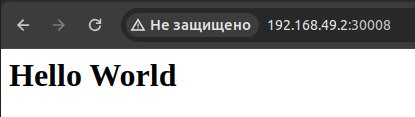

## Задание (обычная)

Поднять kubernetes кластер локально (например minikube), в нём развернуть свой сервис, используя 2-3 ресурса kubernetes. В идеале разворачивать кодом из yaml файлов одной командой запуска. Показать работоспособность сервиса.
(сервис любой из своих не опенсорсных, вывод “hello world” в браузер тоже подойдёт)

## Ход работы
### Подготовка среды
Работа будет выполнена на OS Linux.
1. Установим kubectl (утилита для работы с Kubernetes, которая взаимодействует с кластером через его API).


2. Установим minikube. <b>Minikube</b> — это упрощенная реализация полноценного Kubernetes-кластера специально для маленьких девопсеров.
   


3. Проверим наличие и версию Docker.


### Создание кластера

1. Запустим кластер с помощью драйвера Docker.


2. Добавим в файл hosts новую запись, чтобы связать домен hello-world.local с айпи Minikube


3. Создадим объект Kubernetes из файла deployment.yaml с помощью команды ```kubectl apply -f deployment.yaml```. Отобразим список деплойментов в кластере Kubernetes командой ```kubectl get deployments```. 


```
apiVersion: apps/v1
kind: Deployment
metadata:
  name: hello-world-deployment
spec:
  replicas: 1
  selector:
    matchLabels:
      app: hello-world
  template:
    metadata:
      labels:
        app: hello-world
    spec:
      containers:
      - name: hello-world
        image: nginx:alpine
        ports:
        - containerPort: 80
        volumeMounts:
        - name: html-volume
          mountPath: /usr/share/nginx/html
      volumes:
      - name: html-volume
        configMap:
          name: hello-world-config

---
apiVersion: v1
kind: ConfigMap
metadata:
  name: hello-world-config
data:
  index.html: |
    <html>
    <head><title>Hello World</title></head>
    <body><h1>Hello World</h1></body>
    </html>

---
apiVersion: v1
kind: Service
metadata:
  name: hello-world-service
spec:
  type: NodePort
  selector:
    app: hello-world
  ports:
    - port: 80
      targetPort: 80
      nodePort: 30008
```
Разберемся подробнее, из чего стостоит файл deployment.yaml. Файл включает в себя три объекта: Deployment, ConfigMap и Service.

<b>Deployment:</b> создает один под (```replicas: 1```) с контейнером, основанным на образе nginx:alpine. Контейнер обслуживает на порту 80 и монтирует том ```html-volume``` в папку ```/usr/share/nginx/html```.
Том получает данные из ConfigMap (```hello-world-config```), чтобы в контейнере был доступ к html файлу.

<b>ConfigMap:</b> определяет html страничку (```index.html```), которая выводится при обращении к веб серверу. Страничка представляет собой белый лист, открытый для новых свершений, с претенциозной строчкой Hello World.

<b>Service:</b> создает сервис с типом NodePort, который перенаправляет внешние запросы с порта 30008 на внутренний порт контейнера 80.

<b>Кратко:</b> этот файл разворачивает веб-сервер на nginx, который будет показывать "Hello World" при обращении на порт 30008.

4. Узнаем адрес, на котором запущен сервис.


5. Проверим работоспособность и убедимся, что всё круто.



### Не хочется потерять эти материалы по теме:

1. [Kubernetes](https://kubernetes.io/ru/docs/concepts/overview/components/)
2. [Работа в Kubernetes с помощью Minikube](https://selectel.ru/blog/tutorials/how-to-run-kubernetes-with-minikube/)
