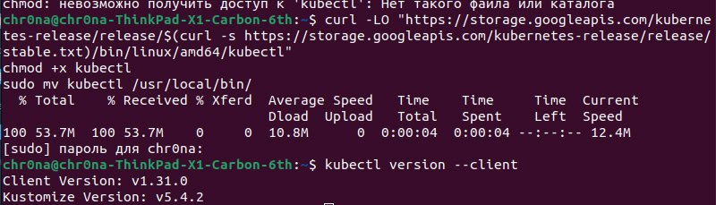
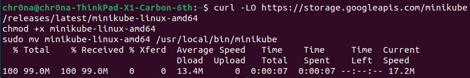
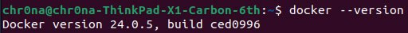
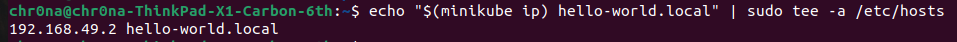
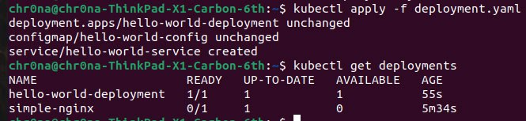
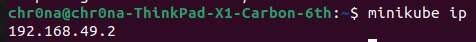

## Задание (обычная)

Поднять kubernetes кластер локально (например minikube), в нём развернуть свой сервис, используя 2-3 ресурса kubernetes. В идеале разворачивать кодом из yaml файлов одной командой запуска. Показать работоспособность сервиса.
(сервис любой из своих не опенсорсных, вывод “hello world” в браузер тоже подойдёт)

## Ход работы
### Подгоnовка среды
Работа будет выполнена на OS Linux.
1. Установим kubectl (утилита для работы с Kubernetes, которая взаимодействует с кластером через его API).



2. Установим minikube. <b>Minikube</b> — это упрощенная реализация полноценного Kubernetes-кластера специально для маленьких девопсеров.
   


3. Проверим наличие и версию Docker.


### Создание кластера

1. Запустим кластер с помощью драйвера Docker.


2. Добавим в файл hosts новую запись, чтобы связать домен hello-world.local с айпи Minikube



3. Создадим объект Kubernetes из файла deployment.yaml с помощью команды ```kubectl apply -f deployment.yaml```. Отобразим список деплойментов в кластере Kubernetes командой ```kubectl get deployments```. 



4. Узнаем адрес, на котором запущен сервис



### 


### 


### Не хочется потерять эти материалы по теме:

1. [Kubernetes](https://kubernetes.io/ru/docs/concepts/overview/components/)
2. [Работа в Kubernetes с помощью Minikube](https://selectel.ru/blog/tutorials/how-to-run-kubernetes-with-minikube/)
