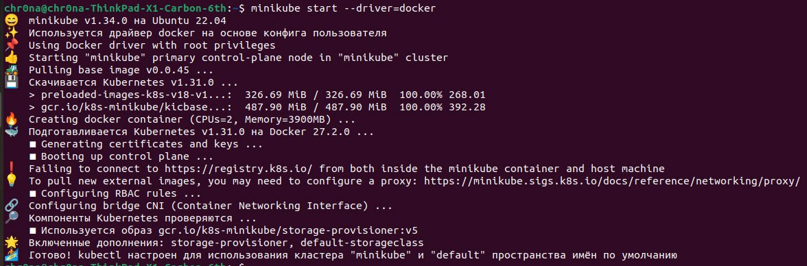

## Задание (обычная)

Поднять kubernetes кластер локально (например minikube), в нём развернуть свой сервис, используя 2-3 ресурса kubernetes. В идеале разворачивать кодом из yaml файлов одной командой запуска. Показать работоспособность сервиса.
(сервис любой из своих не опенсорсных, вывод “hello world” в браузер тоже подойдёт)

## Ход работы
### Подгоьовка среды
Работа будет выполнена на OS Linux.
1. Установим kubectl (утилита для работы с Kubernetes, которая взаимодействует с кластером через его API).

2. Установим minikube. <b>Minikube</b> — это упрощенная реализация полноценного Kubernetes-кластера специально для маленьких девопсеров.
   

3. Проверим наличие Docker.

### Создание сертификатов

1. Создадим локальный кластер Kubernetes.

### 

### 

### Не хочется потерять эти материалы по теме:
1. [Kubernetes](https://habr.com/ru/companies/otus/articles/666700/](https://kubernetes.io/ru/docs/concepts/overview/components/)
2. [Работа в Kubernetes с помощью Minikube](https://selectel.ru/blog/tutorials/how-to-run-kubernetes-with-minikube/)
