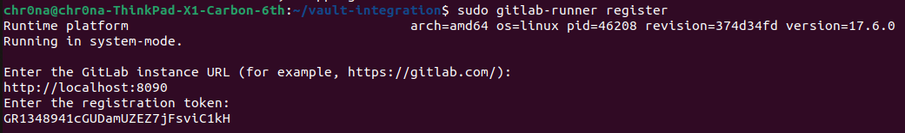
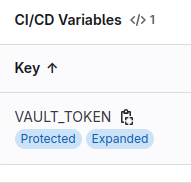
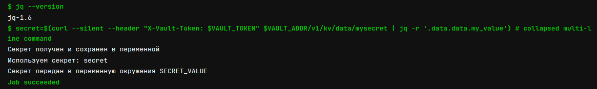

# Лабораторная №4* 

## Задание (со звёздочкой)

Сделать красиво работу с секретами. Например, поднять Hashicorp Vault и сделать так, чтобы ci/cd пайплайн (или любой другой ваш сервис) ходил туда, брал секрет, использовал его не светя в логах. В Readme аргументировать почему ваш способ красивый, а также описать, почему хранение секретов в CI/CD переменных репозитория не является хорошей практикой.

## Ход работы
Хранение секретов в CI/CD переменных репозитория не является хорошей практикой!

<b>Почему:</b>
1. Переменные окружения в CI/CD-платформах обычно доступны любому, у кого есть доступ к репозиторию (и случайные pull requests - не исключение). 
2. Если CI/CD логи не настроены как надо, секреты могут случайно оказаться в логах, где их могут увидеть злоумышлениики.
3. Нельзя разграничить доступ пользователей или процессов. Все пользователи репозитория могут иметь доступ к секретам. Повод задуматься...
4. Каждый из секретов будет привязан к конкретному репозиторию. Его нельзя будет исаользовать где-то ещё. При удалении репозитория все секреты потеряются.
5. Некоторые CI/CD платформы хранят переменные в текстовом виде или недостаточно защищают их при передаче данных. Если платформа не шифрует секреты, они могут быть уязвимы к атаке перехвата.

<b>Что делать:</b> Использовать специализированные менеджеры секретов (например, HashiCorp Vault, AWS Secrets Manager, или Azure Key Vault). Они обеспечивают более высокий уровень безопасности, поддерживают шифрование и аудит доступа к секретам. 

Изначально мы хотели использовать AWS Secrets Manager, но возникли сложности с привязкой карты. Поэтому дальше будем работать с HashiCorp Vault.

### Как я пришёл к выбору Gitlab Community Edition

Начнём с конца. Будучи простым наивным добряком, я начал делать работу: создал аккаунт в Gitlab, установил Vault, поднял его на localhost, создал секрет и запушил .yml файл пайплайна в Gitlab. С первого раза пайплайн не сработал.

<p align="center">
  
</p>

Оказалось, что GitLab взаимодействует с пайплайнами только если твой аккаунт верифицирован. 

<p align="center">
  
</p>

Для верификации требуется зарубежный номер или карта, а так как я патриот - у меня нет ничего из вышеперечисленного. Так что я начал выполнение работы с самого начало, поднимая Gitlab уже собственными силами на локалхосте

### Вторая попытка: установка Gitlab на Ubuntu

На официальном сайте я нашёл гайд по установке (он был немного неверным, потому что предполагал установку gitlab-ee - Enterprise Edition, версии для крупных команд разработчиков от ста человек, в то время как мне был нужен gitlab-ce - Community Edition. Мелочь, которая решается заменой парочки букв, но я какое-то время не вдуплял, почему команды с официального сайта не работают)

<p align="center">
  
</p>

Итак! Я начал с классического ```sudo apt update```, после чего установил зависимости командой ```sudo apt install -y curl openssh-server ca-certificates tzdata perl```. Дальше добавил репозиторий Gitlab и ключ: ```curl -fsSL https://packages.gitlab.com/install/repositories/gitlab/gitlab-ce/script.deb.sh | sudo bash```. Наконец-то можно установить Gitlab командой ```sudo apt install gitlab-ce```.

<p align="center">
  
</p>

Нас встречает лисёнок - значит установка завершилась успешно. Теперь в конфигурационном файле нужно указать адрес, по которому будет доступен Gitlab - я выбрал порт 8080 на локальном хосте.

<p align="center">
  
</p>

Зайдя по этому адресу в браузере, меня встретил уже знакомый интерфейс Gitlab. (правда пришлось 10 минут подождать загрузки, потому что после изменения файла конфигурации нужно было прописать ```reconfigure```, который в первый раз выполнялся очень долго)

<p align="center">
  
</p>

После первого запуска автоматически создался пользователель root, который используется для административного доступа. Я зашёл в Rails-консоль командой ```sudo gitlab-rails console``` и там несколькими командами установил для пользователя пароль в честь моего любимого футболиста Чиро Иммбоиле (**207 голов и 54 голевые передачи за 340 матчей + Золотая бутса в сезоне 19/20!!!**)

<p align="center">
  
</p>

Зайдя в Gitlab, я создал пустой репозиторий vault-integration, в котором будет вестись работа

<p align="center">
  
</p>

Создал локальную папку с таким же названием, связал её с репозиторием и сделал тестовый коммит с файлом .gitignore

<p align="center">
  
</p>

Итак, самая вредная часть работы выполнена

### Работа с Vault

Vault оказался куда более приветливым, чем Gitlab. Я скачал и установил сам Vault и запустил сервер для локальной работы командой ```vault server -dev```. 

<p align="center">
  
</p>

Далее командой ```export VAULT_ADDR='http://127.0.0.1:8200'``` указал переменной адрес, на котором будет работать Vault. Зашёл на него через браузер и попал в веб-интерфейс, где создал секрет, на который буду ссылаться.

<p align="center">
  
</p>

С Vault'ом разобрались

### Gitlab-runner

Для работы с пайплайнами потребовалось установить gitlab-runner. Его установка очень похожа на установку самого гитлаба: тоже копируем скрипт из репозитория и устанавливаем раннер командой ```sudo apt install gitlab-runner```. После установки раннер нужно зарегистрировать, введя ссылку на гитлаб и токен регистрации, который можно взять всё в том же гитлабе, найдя в настройках вкладку ```Runners```

<p align="center">
  
</p>

### Возвращение блудного сына к пайплайну

Теперь, когда проблем с Gitlab, Vault и Runner точно нет, осталось починить файл .yml, потому что его первая версия: 1) неактуальна 2) плохая
Занесём переменную, хранящую токен от Vault, в список переменных окружения в Gitlab, сделав её защищённой, чтобы токен не выводился в логах (сюда же стоило добавить и адрес Vault'а, но я почему-то забыл...Но так правильнее!)

<p align="center">
  
</p>

Текст нового файла .yml:

```
stages:
  - test

variables:
  VAULT_ADDR: "http://127.0.0.1:8200"
  VAULT_TOKEN: $VAULT_TOKEN

test_secrets:
  stage: test
  script:
    - echo "Получаем секреты из Vault"
    - apt-get update || true && apt-get install -y curl jq || true
    - curl --version
    - jq --version
    - |
      secret=$(curl --silent --header "X-Vault-Token: $VAULT_TOKEN" $VAULT_ADDR/v1/kv/data/mysecret | jq -r '.data.data.my_value')
      echo "Секрет получен и сохранен в переменной"
      echo "Используем секрет: $secret"
      export SECRET_VALUE=$secret
      echo "Секрет передан в переменную окружения SECRET_VALUE"

```

Здесь после update и install стоят ``|| true``, чтобы в случае незначительных проблем с источниками репозиториев не прерывать выполнение пайплайна. При этом перед извлечение секрета мы проверям, что ```curl``` и ```jq``` были успешно установлены - таким образом, неначительные ошибки в установке не остановят пайплайн, но если что-то случится с теми командами, которые требуются нам для основной работы, пайплайн будет остановлен
Сам секрет будет безопасно извлечен и передан в переменную окружения SECRET_VALUE (на реальном проекте вывод секрета в логи конечно же недопустим, тут я вывожу его только ради того, чтобы показать, что пайплайн успешно работает). 
После пуша новой версии файла в репозиторий видим, что пайплайн сработал без ошибок 

<p align="center">
  
</p>

Зайдем во вкладку ```Jobs``` в проекте и увидим, что всё работает правильно - ошибок в ходе выполнения не случилось и переменная получился именно тот нужный секрет, который создавался ранее

<p align="center">
  
</p>


### Не хочется потерять эти материалы по теме:
1. [Используем Hashicorp Vault для хранения секретов](https://habr.com/ru/articles/653927/)
2. [CI/CD-пайплайн на примере одного небольшого проекта Уральской Дирекции ИТ](https://habr.com/ru/companies/alfa/articles/359030/)
3. [Избавляемся от паролей в репе с кодом с помощью HashiCorp Vault Dynamic Secrets](https://habr.com/ru/companies/quadcode/articles/565690/comments/)
4. [Как управлять вашими секретами с git-crypt](https://habr.com/ru/companies/nixys/articles/570306/)
