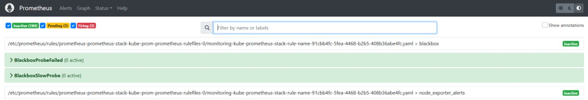
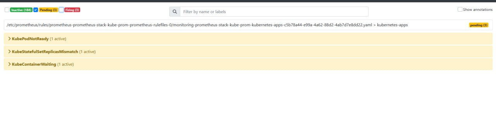
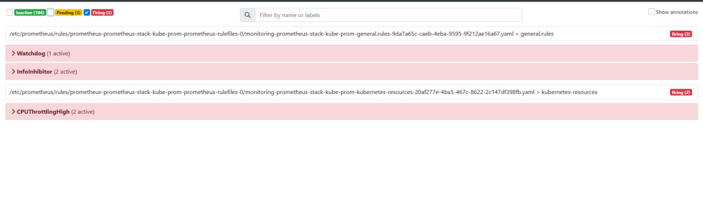
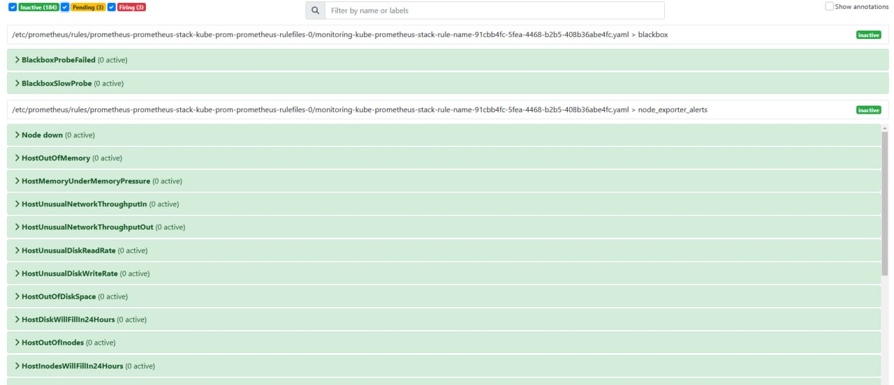

# Лабораторная №5 

## Задание (со звёздочкой)
Настроить алерт кодом IaaC (например через конфиг алертменеджера, главное - не в интерфейсе графаны:), показать пример его срабатывания. Попробовать сделать так, чтобы он приходил, например, на почту или в телеграм. Если не получится - показать имеющийся результат и аргументировать, почему дальше невозможно реализовать.

## Ход работы
> Алерт в Prometheus — это механизм, который позволяет отслеживать события, требующие внимания и уведомлять о них.

В Prometheus алерты настраиваются с помощью правил оповещений, которые представляют собой выражения на языке PromQL (Prometheus Query Language). Эти выражения анализируют метрики и генерируют уведомления, если условия, описанные в правиле, выполняются. Алерты могут быть настроены для разных типов событий: превышение порога значения метрики, пропажа данных, ошибка системы.

После срабатывания правила алерта, Prometheus отправляет уведомления в Alertmanager, который обрабатывает и направляет их в нужный канал: на электронную почту, в Slack (умер) или в телеграм (как в нашем случае).

1. Посмотрим статусы алертов в Prometheus.
<b>Active:</b> показывает, какие алерты активны в данный момент.

<b>Pending:</b> алерты, которые находятся в стадии ожидания срабатывания, если условия продолжают выполняться.

<b>Inactive:</b> алерты, которые в настоящее время неактивны.

### Не хочется потерять эти материалы по теме:
1. [Основы мониторинга (обзор Prometheus и Grafana)](https://habr.com/ru/articles/709204/)
2. [Grafana как еще один инструмент для технического мониторинга создаваемых нами программных продуктов](https://habr.com/ru/companies/slurm/articles/431122/)
