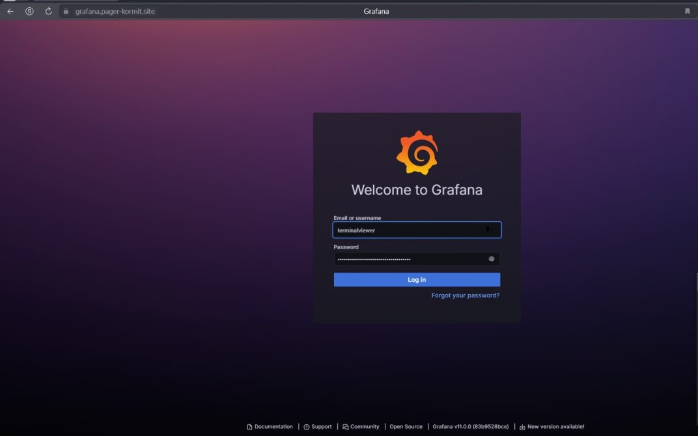
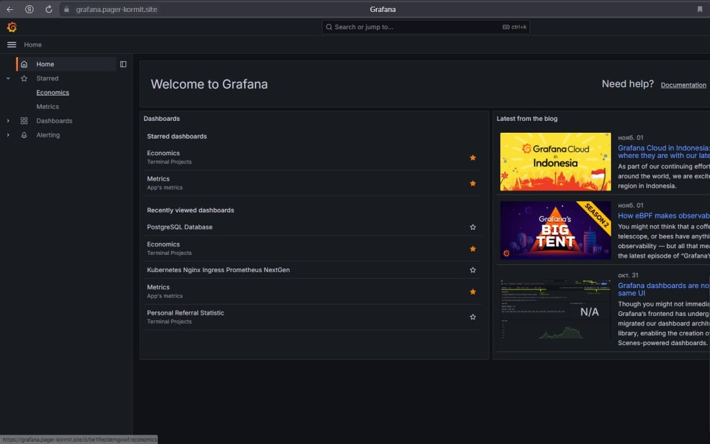
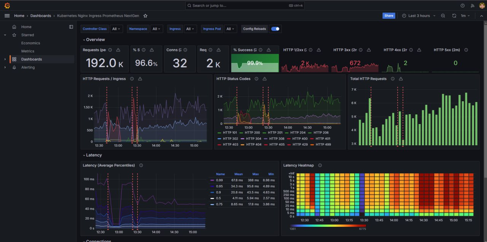

# Лабораторная №5 

## Задание (обычная)
Сделать мониторинг сервиса, поднятого в кубере (использовать, например, prometheus и grafana). Показать хотя бы два рабочих графика, которые будут отражать состояние системы. Приложить скриншоты всего процесса настройки.
Прочитать историю про Васю (она быстрая, забавная и того стоит): https://habr.com/ru/articles/689234/

## Ход работы
### Установка
1. Создадим пространство имен <b>monitoring</b> в нашем кластере Kubernetes. В этом пространстве мы сможем развернуть Prometheus и Grafana для мониторинга кластера и сервисов.
```
kubectl create namespace monitoring
```
Что такое <b>пространство имен</b>? Это виртуальный кластер внутри кластера Kubernetes (можно создать несколько изолированных друг от друга пространств внутри одного кластера). Kubernetes использует пространство имен «default» как место, в котором создаются наши сервисы и приложения. Это отлично подходит для начала работы и систем с небольшой производительностью, но использовать default namespace в больших prod-системах - не лучшая практика. Так одна команда разработчиков может легко переписать чужой код и нарушить работу другой команды, даже не осознавая этого. Поэтому следует создать несколько пространств имен и использовать их для сегментации услуг в управляемые звенья. Пространство имен можно создать с помощью одной команды/YAML-файла.


2. Установим PostgreSQL с использованием Helm (менеджер пакетов).
```
helm install my-postgresql oci://registry-1.docker.io/bitnamicharts/postgresql --namespace monitoring
```
В ссылке на пакет PostgreSQL из репозитория Bitnami видим чарты. <b>Чарты</b> — это пакеты, которые могут включать в себя все для запуска приложения в Kubernetes, от deployments до services. Все это дает возможность работать с приложениями как с единой сущностью, а не как с набором отдельных ресурсов, которые еще и в ручную нужно настраивать.

3. Обновим конфигурацию PostgreSQL.
```
helm upgrade -f postgresql/values.yaml my-postgresql oci://registry-1.docker.io/bitnamicharts/postgresql --namespace monitoring
```
4. Установим Prometheus. <b>Prometheus</b> — система мониторинга серверов и программ с открытым исходным кодом.
```
helm repo add prometheus-community https://prometheus-community.github.io/helm-charts
helm install my-prometheus prometheus-community/prometheus --namespace monitoring
```

5. Установим Grafana. <b>Grafana</b> — это платформа с открытым исходным кодом для визуализации, мониторинга и анализа данных.
```
helm repo add grafana https://grafana.github.io/helm-charts
helm install my-grafana grafana/grafana --namespace monitoring
```
> Дальше душа стала требовать большого светлого ~~нефильтрованного~~. И мы решили стать кротами на работе у Серёжи.

6. Поднятие Grafana было осуществлено на собственном домене pager-kormit.site, так как в дашборды строились для рабочего проекта на 1.5 млн записей в БД.

### Настройка

1. Заходим через интерфейс Grafana.



2. По нехитрым названиям видим, что настройка дашборда была произведена для экономических метрик проекта, нагрузочных метрик проекта. Также были сделаны дашборды под базу данных и реферальную статистику.



3. Посмотрим настройку панели Grafana для мониторинга активных сессий базы данных PostgreSQL.
Разберемся с конфигурацией:

<b>Datasource</b> указывает на источник данных. В нашем случае установлено использование метрик, собранных Prometheus.

<b>Grid Position</b> определяет размеры и положение панели на дашборде (h, w, x, y).

<b>Targets</b> содержит выражение expr для получения данных. У нас это ```pg_stat_activity_count(datname=~"$datname", instance=~"$instance", state="active")``` используется для подсчета активных сессий в базе данных PostgreSQL, фильтруя по имени базы данных, инстансу и состоянию активности.

<b>Format</b> тип данных, возвращаемых Prometheus. У нас это time_series, что подходит для временных рядов.

<b>Legend Format</b> — формат легенды (не очевидно).

4. Дашборды! Вот они сверху вниз.
Дашборд нагрузки nginx с использованием prometheus.


Воспользуемся случаем и проанализируем то, что мы увидели.

<b>Requests (pe):</b> 192.0K. Это значит, что за 3 часа сервис обработал 192,000 запросов. Вай, высокая нагрузка системы!

<b>% Success: 96.6%:</b> Высокий процент успешных запросов. Но почему 3.4% запросов завершились с ошибками? При высокой нагрузке даже такой небольшой процент может означать значительное число ошибочных запросов. Серёжа, надо разобраться.

<b>HTTP 2xx (Успешные запросы):</b> Преобладают, это круто.

<b>HTTP 4xx (Ошибки клиента):</b> 672 ошибок. Обычно это указывает на проблемы с запросами, например, неверные URL или неправильная аутентификация.

<b>HTTP 5xx (Ошибки сервера):</b> 2 ошибки. Да, их мало, но повод для исследования есть.

<b>[Средняя задержка (Mean)](https://habr.com/ru/companies/ddosguard/articles/499756/):</b> Среднее время отклика составляет 34.3 ms. Однако, можно увидеть всплески в районе 100 ms, но всё равно это очень хороший показатель.

<b>Latency Heatmap:</b> Тепловая карта показывает, что в некоторые моменты времени задержка значительно возрастает. Такое поведение может указывать на пиковую нагрузку или сбои в работе системы.

<b>Conns:</b> 32: Активные соединения в момент времени. Небольшое число соединений говорит о стабильной работе с точки зрения числа текущих пользователей или сессий.

<b>HTTP Requests график:</b> Наблюдаются регулярные всплески запросов, что может свидетельствовать о пиковых нагрузках.

#### Серёжа, будь осторожен.
1. Ошибки клиента (HTTP 4xx) - это не шутка. Необходимо проанализировать причины ошибок, чтобы понять, почему клиенты отправляют некорректные запросы. Это может быть вызвано неправильной конфигурацией или устаревшими API вызовами.
2. Ошибки сервера (HTTP 5xx). Кажется, что пустяк, но нужно удостовериться, что эти ошибки не связаны с критическими проблемами инфраструктуры или базы данных.
3. А у вас настроены оповещения в случае резких всплесков ошибок или увеличения времени отклика? Если нет, повод задуматься.

### Не хочется потерять эти материалы по теме:
1. [Основы мониторинга (обзор Prometheus и Grafana)](https://habr.com/ru/articles/709204/)
2. [Grafana как еще один инструмент для технического мониторинга создаваемых нами программных продуктов](https://habr.com/ru/companies/slurm/articles/431122/)


