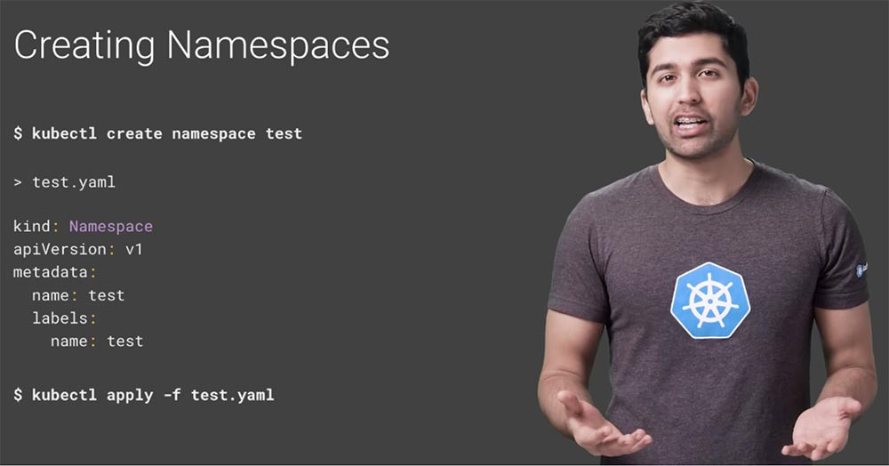

# Лабораторная №5 

## Задание (обычная)
Сделать мониторинг сервиса, поднятого в кубере (использовать, например, prometheus и grafana). Показать хотя бы два рабочих графика, которые будут отражать состояние системы. Приложить скриншоты всего процесса настройки.
Прочитать историю про Васю (она быстрая, забавная и того стоит): https://habr.com/ru/articles/689234/

## Ход работы
### Установка
1. Создадим пространство имен <b>monitoring</b> в нашем кластере Kubernetes. В этом пространстве мы сможем развернуть Prometheus и Grafana для мониторинга кластера и сервисов.
```
kubectl create namespace monitoring
```
Что такое <b>пространство имен</b>? Это виртуальный кластер внутри кластера Kubernetes (можно создать несколько изолированных друг от друга пространств внутри одного кластера). Kubernetes использует пространство имен «default» как место, в котором создаются наши сервисы и приложения. Это отлично подходит для начала работы и систем с небольшой производительностью, но использовать default namespace в больших prod-системах - не лучшая практика. Так одна команда разработчиков может легко переписать чужой код и нарушить работу другой команды, даже не осознавая этого. Поэтому следует создать несколько пространств имен и использовать их для сегментации услуг в управляемые звенья. Пространство имен можно создать с помощью одной команды/YAML-файла.



2. Установим PostgreSQL с использованием Helm (менеджер пакетов).

```
helm install my-postgresql oci://registry-1.docker.io/bitnamicharts/postgresql --namespace monitoring
```
В ссылке на пакет PostgreSQL из репозитория Bitnami видим чарты. <b>Чарты</b> – это пакеты, которые могут включать в себя все для запуска приложения в Kubernetes, от deployments до services. Все это дает возможность работать с приложениями как с единой сущностью, а не как с набором отдельных ресурсов, которые еще и в ручную нужно настраивать


### Не хочется потерять эти материалы по теме:
1. [Основы мониторинга (обзор Prometheus и Grafana)](https://habr.com/ru/articles/709204/)
2. [Grafana как еще один инструмент для технического мониторинга создаваемых нами программных продуктов](https://habr.com/ru/companies/slurm/articles/431122/)


